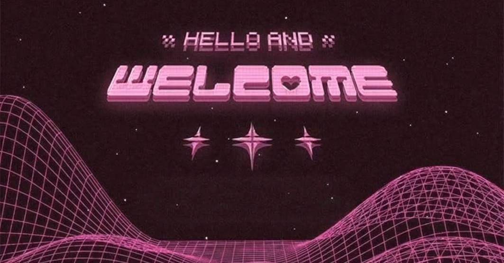
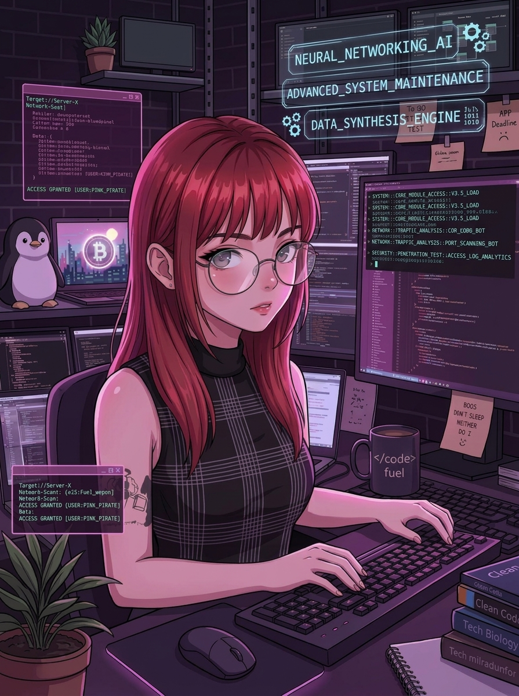

<!-- ==================== BANNER ==================== -->

<!-- ==================== INTRO ==================== -->

<h2>Olá, eu sou a Thays 👋</h2>

<strong>Estudante de Engenharia de Software</strong> 
com foco em Cibersegurança, Desenvolvimento e Tecnologia</strong>

🔐 Pentest & Web Security 
🛡️ SOC / NOC & Security Monitoring 
💻 Software Development

<em>Learning by building, testing and breaking things.</em>

<!-- ==================== ABOUT ME ==================== -->

<h3 align="center">🩷 Sobre mim</h3>

  Sou estudante de <strong>Engenharia de Software</strong> e estou construindo minha carreira em Tecnologia.

  Tenho interesse em <strong>Cibersegurança, Desenvolvimento de Software,
  Suporte e Infraestrutura de TI</strong>.

  Gosto de aprender na prática, através de laboratórios, projetos, desafios técnicos e experimentação, documentando o que aprendo ao longo do caminho.

🔐 Cybersecurity &nbsp; • &nbsp;
🌐 Web Security &nbsp; • &nbsp;
🧪 Pentesting Labs

🛡️ SOC / NOC &nbsp; • &nbsp;
📡 Security Monitoring &nbsp; • &nbsp;
💻 Software Development

 
<!-- ==================== TECH STACK ==================== -->

<h2 align="center">💻 Tecnologias e Ferramentas</h2>

<h3 align="center">Programming & Development</h3>

<h3 align="center">Cybersecurity & Tools</h3>

<!-- ==================== SECURITY LABS ==================== -->

<h2 align="center">🧪 Security Labs</h2>

  Laboratórios práticos, exercícios e estudos voltados para cibersegurança.

**🌐 Web Security**

`SQL Injection` · `SSRF` · `GraphQL` · `Burp Suite`

**🔎 Enumeration**

`Nmap` · `SMB` · `SNMP` · `LDAP`

**📱 Mobile Security**

`APK Analysis` · `Static Analysis` · `Android Security`

**🛡️ Security Operations**

`Network Monitoring` · `Security Monitoring` · `SOC Fundamentals`

> 🩷 Aos poucos, vou adicionando os write-ups e a documentação detalhada dos laboratórios realizados.

<!-- ==================== LEARNING JOURNAL ==================== -->

<h2 align="center">🩷 Learning Journal</h2>

  Registros de conceitos, laboratórios, experimentos e aprendizados ao longo da minha jornada.

🔐 Cybersecurity  
**Pentesting · Web Security · Android Security · Network Security**

💻 Software Engineering  
**Java · Spring Boot · Web Development · APIs**

🌐 Networking  
**Network Fundamentals · Protocols · Troubleshooting**

🛡️ Security Operations  
**SOC · NOC · Monitoring · Security Fundamentals**

  

  O link abaixo direcionará para o repositório completo..

  <a href="https://github.com/Thays-Quispe/learning-journal">
    <strong>Explore my Learning Journal →</strong>
  </a>

<!-- ==================== PROJECTS ==================== -->

<h2 align="center">🚀 Projects</h2>

  Desenvolvendo projetos enquanto aprimoro minhas habilidades em Engenharia de Software e Cibersegurança.

 

<table align="center">
  <tr>
    <td width="50%" align="center">
      <h3>🎬 Projeto Netflix</h3>
      

        Página web inspirada em plataformas de streaming, desenvolvida durante uma imersão da Alura utilizando HTML, CSS, JavaScript e Inteligência Artificial.
      

      

        
        
        
      

      
    </td>
    <td width="50%" align="center">
      <h3>✂️ ClipMaker</h3>
      

        Aplicação web desenvolvida durante o NLW Operator da Rocketseat, utilizando Inteligência Artificial para analisar transcrições e auxiliar na criação de clipes curtos.
      

      

        
        
        
        
      

      
    </td>
  </tr>
</table>

 

  🩷 <strong>Mais projetos em breve...</strong>

<!-- ==================== GITHUB STATS ==================== -->

<h2 align="center"> GitHub Stats</h2>

<!-- ==================== CONNECT ==================== -->

<h2 align="center"> Vamos nos conectar?</h2>

  Estou sempre aberta a conhecer pessoas interessadas em tecnologia, cibersegurança e desenvolvimento de software.

&nbsp;&nbsp;

